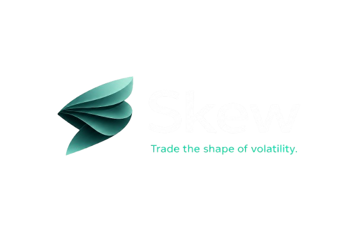

<p align="center">
  
</p>

<p align="center">
  <b>Trade the shape of volatility.</b>
</p>

<p align="center">
  A live 3D volatility-surface trading terminal for BTC on Sui, powered by DeepBook Predict.
</p>

<p align="center">
  
  
  
  
  
  
</p>

---

## Meet Skew

Most prediction markets give you yes or no. Skew lets you trade the way you actually think: set your own strike, stitch a range in one tap, add leverage, and watch the live volatility surface that prices your bet. The DeepBook liquidity vault is always the house, so there is never a wait for someone to take the other side.

> **Skew is a prediction market on Sui where you finally trade the way you actually think, not just YES or NO. Skew fixes what prediction markets got wrong.**

The canonical Predict UI shows a flat list of markets. Skew renders the real SVI volatility surface the protocol prices against, and lets anyone click a point to mint that exact binary or range.

| Every other market | Skew |
| --- | --- |
| Pick from a list | Pick the number |
| Will BTC close above $70K? &nbsp; `62c` &nbsp; YES / NO | |
| Will BTC close above $75K? &nbsp; `48c` &nbsp; YES / NO | **BTC closes above** |
| Will BTC close above $80K? &nbsp; `31c` &nbsp; YES / NO | **`$91,480`** |
| Will BTC close above $85K? &nbsp; `12c` &nbsp; YES / NO | |

---

## Problems and fixes

Five things prediction markets get wrong, and how Skew fixes each.

| Problem | Skew fix |
| --- | --- |
| **Black-box pricing** | Every other market hands you a price and asks you to trust it. Skew shows the **live volatility surface pricing your bet**, so you see exactly how your number is set. |
| **No house** | On peer-to-peer markets you wait for someone to take the other side. On Skew the **DeepBook liquidity vault is the house**: always the counterparty, priced by the surface. |
| **Fixed strikes** | Other platforms pick the strikes. On Skew you **set your own strike**, at any price you like. |
| **Stitched ranges** | Building a range elsewhere means two trades and two lots of fees and slippage. On Skew you pick two price points and get **one trade, one cost, one payout**, in a single tap. |
| **No leverage** | Add **leverage** to scale your position, and you can **never lose more than what you paid**. |

> The peer-to-peer flaw is real. The Wall Street Journal found that on Polymarket, **67% of profits went to just 0.1% of accounts**, fewer than 2,000 wallets sharing nearly half a billion dollars, because there is no house and users only trade against each other. Skew's vault removes that bottleneck.
>
> _Source: Wall Street Journal_

---

## Why Sui and DeepBook Predict

**Sui is the only chain where Skew works, and Skew brings Sui something new.**

**Sui to Skew**

- **DeepBook's live pricing surface**, the engine Skew is built on.
- **~390ms settlement and sub-cent fees**, cheap enough to trade any price.
- **Google login, gasless**, through zkLogin and sponsored transactions.

**Skew to Sui**

- A trading experience you **cannot get anywhere else**.
- A new wave of **Sui-natives** riding the prediction-market boom.
- A **flagship DeFi app** powered by DeepBook Predict.

---

## Features

| Feature | What it does |
| --- | --- |
| **Live 3D volatility surface** | The actual SVI surface the protocol prices against, rendered live in strike by expiry by implied vol. It is not a chart of the market. It is the market. |
| **One-click mint** | Click any point on the surface and mint that exact strike and expiry in a single transaction. The surface is the trade ticket. |
| **Binary and range** | Bet up or down at a strike, or take a native vertical range band. One position, one fee, one slippage, no legging in. |
| **BTC options data** | Implied vol, expected range, max pain, skew, and options flow, in plain language for first-timers and full depth for pros. |
| **Kelly co-pilot** | Talk to the surface. Kelly reads the vol, recommends a range with odds and payout, and loads it into your ticket. It never signs for you. |
| **Gasless zkLogin** | Sign in with Google and trade with sponsored gas through Enoki. No wallet extension and no gas balance needed. |
| **Live PnL cockpit** | Open bets are pinned onto the 3D surface with live profit and loss, direction, and a countdown to expiry. |
| **Time-travel scrub** | Drag to replay how the surface breathed through recent history, then snap back to the live stream. |
| **No-arb checker** | Butterfly and calendar violations flare on the surface, with a stress toggle to prove the check fires on demand. |
| **Trader analytics** | A live flow tape, market sentiment, and trader-style breakdowns, free and open to everyone. |
| **Leaderboard and copy-trade** | Rank live traders, open a trader profile, and copy their setup into your own ticket in a click. |
| **Crash protection** | Hedge an open position with a budget-bounded down bet, sized so your worst case is capped up front. |

---

## Meet Kelly


Ask Kelly to recommend a range and it reads the volatility on the surface, picks a band, shows you the odds and payout, and loads it straight into your ticket. Ask why BTC is moving and it strings together the drivers.

Kelly explains, highlights, and pre-fills, but it never signs a transaction for you. The controls stay in your hands.

<br clear="right" />

---

## Tech stack

| Layer | Version | Notes |
| --- | --- | --- |
| Next.js | 16 | App Router, React Server Components, Turbopack |
| React | 19 | Client leaves isolate the canvas, wallet, and live tape |
| TypeScript | strict | One shared scale layer keeps 1e9 and 6-decimal math honest |
| TailwindCSS | 4 | Token-driven dark terminal styling |
| React Three Fiber + three.js | 9 / 0.184 | The volatility surface, one canvas, one render loop |
| GSAP | 3 | The load choreography and the time-travel scrub |
| lightweight-charts + visx | 5 / 3 | Price, payoff, vault, and inventory panels |
| Zustand | 5 | Shared selection state bridging surface and ticket |
| TanStack Query | 5 | Server snapshots and the live poll layer |
| @mysten/sui + dapp-kit + Enoki | 2 / 1 | PTBs, devInspect quotes, zkLogin and gas sponsorship |
| Anthropic SDK | 0.115 | The reasoning seam behind Kelly |
| Upstash Redis | edge | Caching for the data and insights routes |

---

## Getting started

```bash
# from the repo root
cd deep-book-terminal_app
npm install
npm run dev
```

Open [http://localhost:3000](http://localhost:3000) and you land on the live surface.

Network-keyed contract ids live in `config/predict.ts`, and scale helpers in `config/scale.ts`. Add your keys for Enoki, Anthropic, and Upstash to `.env.local` to light up gasless sign-in, Kelly, and the cached data routes.

```bash
npm run dev     # turbopack dev server
npm run build   # production build
npm run lint    # eslint
npm run test    # vitest (SVI math, sizing, insights)
```

---

## Project structure

| Path | What lives there |
| --- | --- |
| `app/` | Routes and UI. The `v2/` tree is the current deployment; components live in `app/_components`. |
| `lib/` | The SVI math spine, Sui PTB and budget-mint helpers, the insights engine, and the Zustand stores. |
| `config/` | `predict.ts` holds the network-keyed ids; `scale.ts` holds the 1e9 and 6-decimal converters. |
| `contracts/` | Optional Move helpers we compose on top of Predict, such as the builder-fee router. |
| `keeper/` | The off-chain price and scheduler keeper. |

---

<p align="center">
  Built for Sui Overflow 2026 &middot; DeepBook track
</p>

<p align="center">
  <b>Trade the shape of volatility.</b>
</p>
